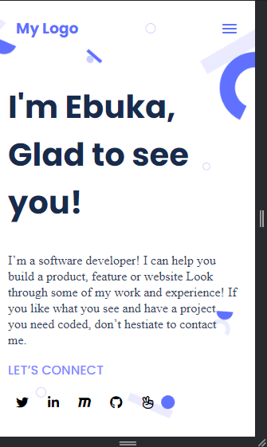

# ebuka-portfolio
# Portfolio-setup-and-mobile-version-skeleton

> This is a Mobile version of my Portfolio Website.

## Below is a GIF showing my Portfolio


This website is a setup and mobile version skeleton of my portfolio.

## Setup

### Clone this repository

```bash
$ git clone https://github.com/EbukaNweje/ebuka-portfolio.git
$ cd Portfolio
```
### Run the live server or open index.html with your browser

## Live Demo

You can see [my page live here](https://ebukanweje.github.io/ebuka-portfolio/)

## Built With

- HTML
- CSS
- VSCode

## Author

👤 **Ebuka Nweje Favour**

- GitHub: [@githubhandle](https://github.com/EbukaNweje)
- Twitter: [@twitterhandle](https://twitter.com/NwejeEbuka)
- LinkedIn: [LinkedIn](https://www.linkedin.com/in/ebuka-nweje-b5993317a/)

## 🤝 Contributing

Contributions, issues, and feature requests are welcome!

## Show your support

Give a ⭐️ if you like this project!

## 📝 License

This project is [MIT](LICENSE) licensed.
